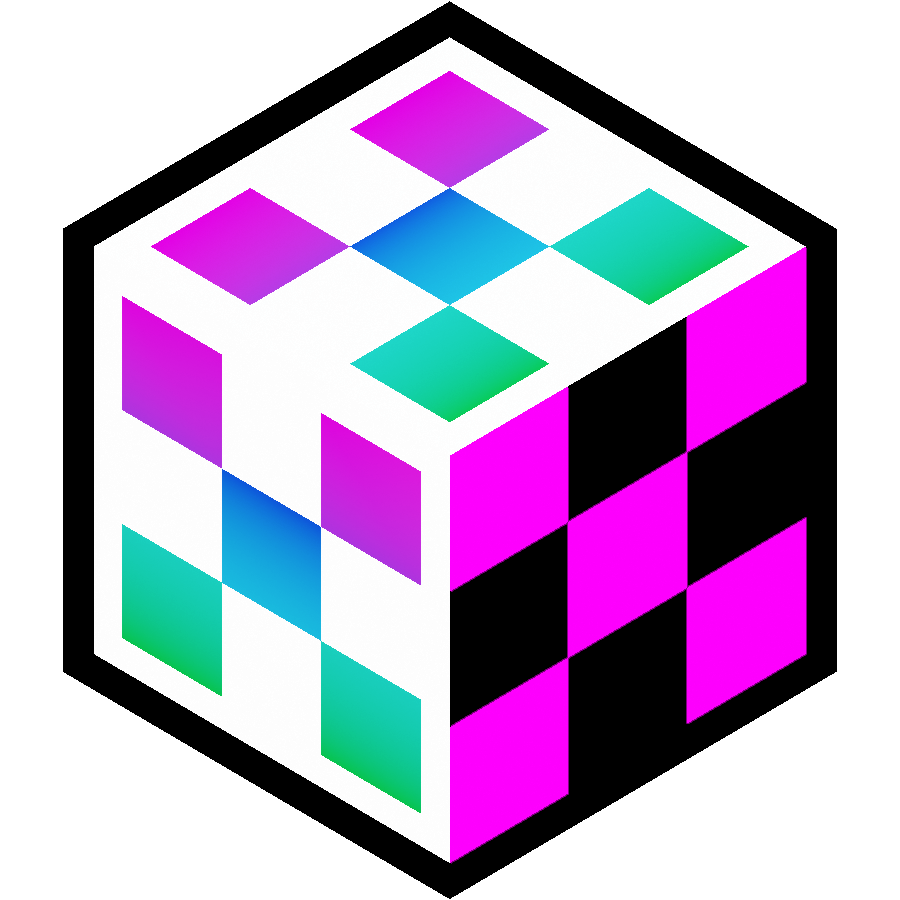
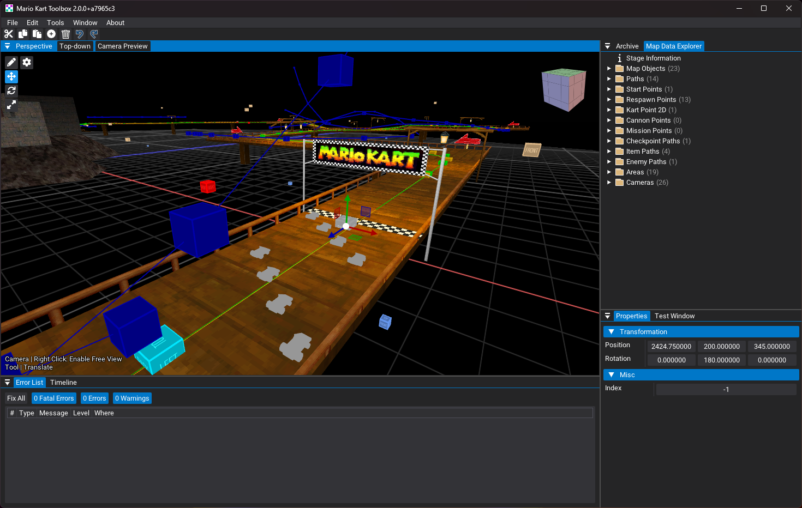
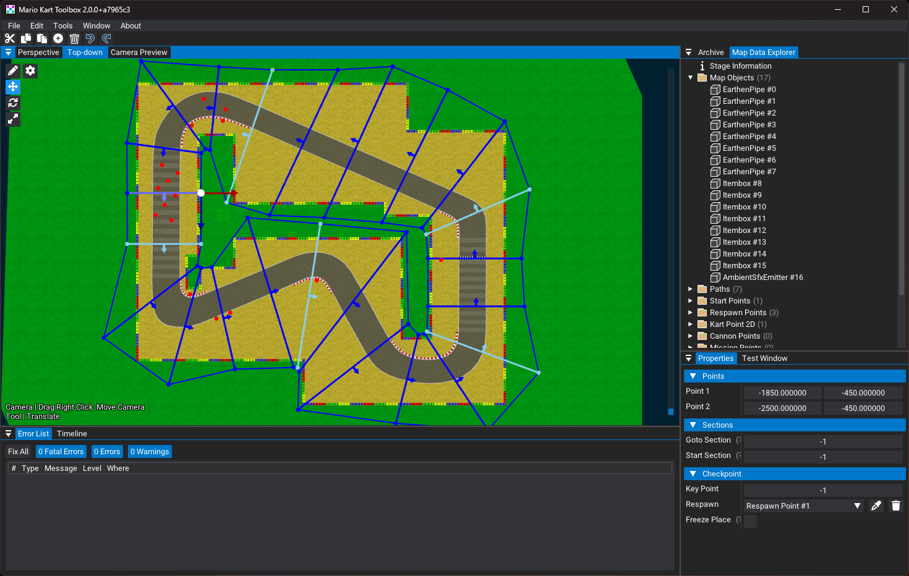
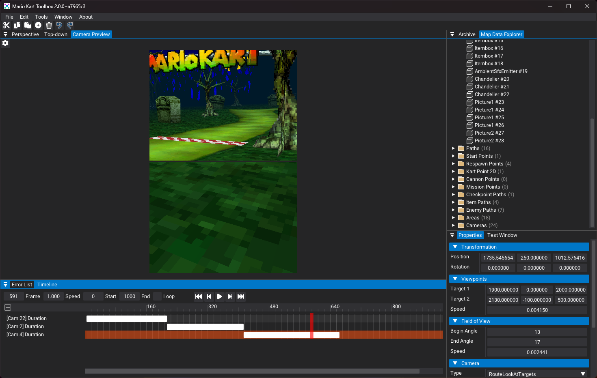

# Mario Kart Toolbox 

**Mario Kart Toolbox** is a fully-fledged editor for Mario Kart DS.

## Features
- Course Editor
    - Edit all NKM sections visually
    - New error detection
    - New and improved collision generator and viewer
    - 2D and 3D gizmos with keyboard shortcuts
    - Easy drawing tools
    - Live camera editor
    - And more...

## Planned
Planned features will be added in the issues of this repository.
- Character and Kart Editors
- Easy to use ROM explorer
- Command line support

## Screenshots

## Credits

### Software
- [Dear ImGui](https://github.com/ocornut/imgui)
- [ImGui.NET](https://github.com/ImGuiNET/ImGui.NET)
- [ImGuizmo](https://github.com/CedricGuillemet/ImGuizmo)
- [RiiStudio](https://github.com/riidefi/RiiStudio)
- [OpenTK](https://github.com/opentk/opentk)
- [Autofac](https://github.com/autofac/Autofac)
- [coverlet.collector](https://github.com/coverlet-coverage/coverlet)
- [Discord RPC C#](https://github.com/Lachee/discord-rpc-csharp)
- [FluentAssertions](https://github.com/fluentassertions/fluentassertions)
- [Moq](https://github.com/devlooped/moq)
- [NativeFileDialogs.Net](https://github.com/Speykious/NativeFileDialogs.NET)
- [Json.NET](https://github.com/JamesNK/Newtonsoft.Json)
- [NUnit](https://github.com/nunit/nunit)
- [SixLabors.ImageSharp](https://github.com/SixLabors/ImageSharp)
- [TextCopy](https://github.com/CopyText/TextCopy)
- [xUnit.net](https://github.com/xunit/xunit)

### Assets
- Logo design by [Daniel @kaasiand](https://twitter.com/kaasiand)

### Testing
- Mario Kart DS Modding Discord Server

## License
Mario Kart Toolbox is licensed under the MIT License, see [LICENSE](./../LICENSE) for more information.